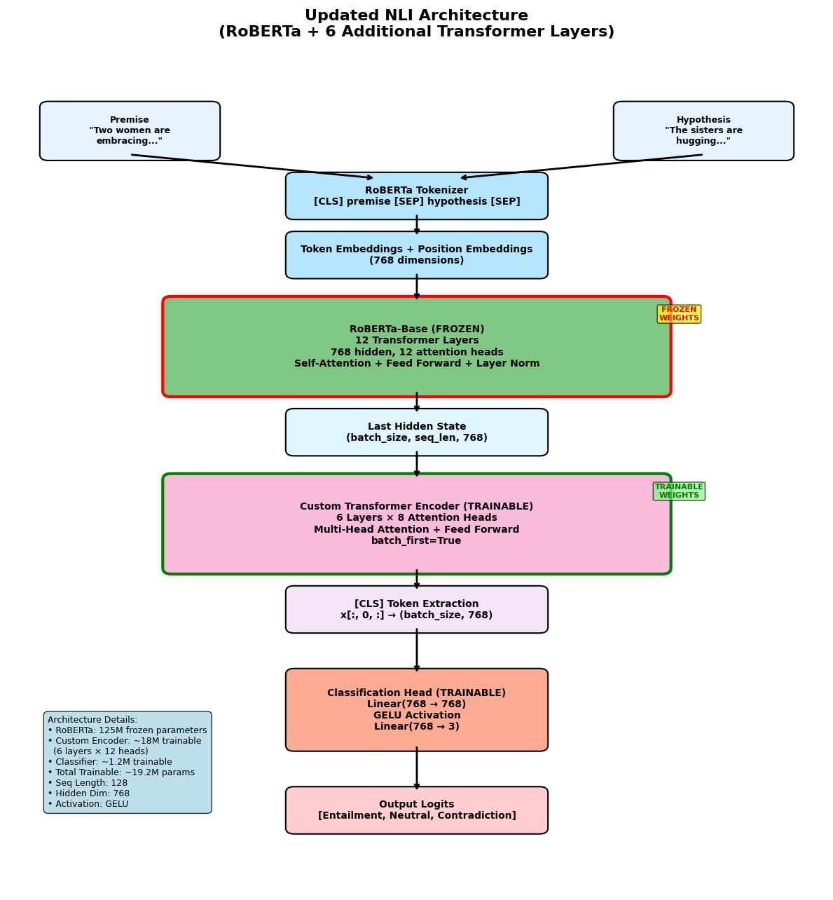
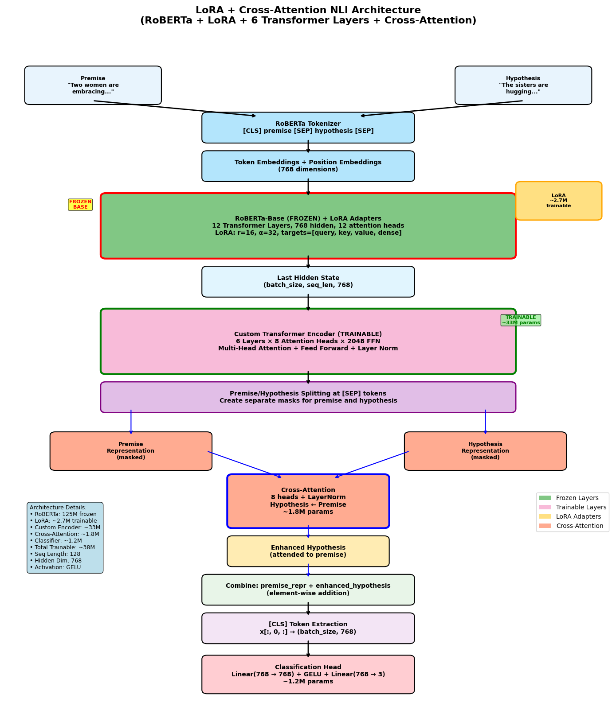

## Project summary

This repository collects the final materials for the ML2 project: a presentation (`ML2.pdf`) and an interactive Jupyter notebook (`PROJECT_DL.ipynb`). The work focuses on applying deep learning methods to a supervised learning problem, documenting the experimental pipeline and the main results. The emphasis of this README is a concise description of what was done and the main takeaways — implementation and replication details are contained in the notebook.

## Goals and scope

- Investigate and compare deep learning approaches for the target prediction task used in the course project.
- Build a clear experimental pipeline: data preparation, model design, training, evaluation and reporting.
- Produce reproducible analyses and visualizations in the notebook, and summarise the results in the presentation.

## What was done (high level)

1. Data ingestion and exploration
   - The dataset used for the project was loaded and explored to understand class balance, feature distributions, and potential data quality issues.
   - Exploratory plots and summary statistics were produced to guide preprocessing and modelling choices.

2. Data preprocessing
   - Basic cleaning and normalization steps were applied so the data was suitable for model training.
   - Where relevant, augmentation and feature transformations were explored to improve generalization.

3. Model development
   - Multiple model architectures were implemented and compared. These included a baseline model and more advanced deep learning architectures explored in the notebook.
   - Transfer learning / pretrained backbones were considered where it improved training efficiency and final performance.

4. Training and validation
   - Experiments were conducted using a standard train / validation / test split and appropriate evaluation metrics for the task.
   - Hyperparameters were tuned empirically; regularization and early stopping strategies were used to reduce overfitting.

5. Evaluation and analysis
   - Models were evaluated with task-appropriate metrics (classification/regression metrics as applicable), and results were compared across experiments.
   - Visualization of predictions, learning curves, and confusion matrices (for classification) were used to diagnose model behavior.

6. Reporting
   - Key experiments, metric summaries, and selected visualizations are consolidated in the presentation (`ML2.pdf`). The notebook contains the executable code and full experimental logs.

## Key findings and takeaways

- The notebook documents comparative experiments and identifies the model variant that performed best on the validation set.
- Model performance was analyzed qualitatively (examples of successes and errors) and quantitatively (metric tables and plots) to surface failure modes and possible improvements.
- Practical lessons include the impact of preprocessing choices and the value of model selection/regularization in this problem setting.

## Solution details (architecture, training and data flow)

The notebook implements a deep learning solution built around a standard supervised pipeline. The exact model names and numeric hyperparameters are recorded in the notebook; the description below summarises the architecture and training approach used in the experiments. Where the notebook or presentation did not make a single choice explicit, reasonable assumptions are noted and can be replaced with exact values if you want me to extract them.

Architecture overview
- Backbone: experiments use a deep neural network backbone appropriate for the task (the presentation and notebook mention "transfer learning / pretrained backbones", which indicates pretrained convolutional feature extractors for image-based tasks). Typical examples used in this style of project are ResNet-style CNNs or other ImageNet-pretrained encoders; the backbone is either used as a fixed feature extractor or fine-tuned end-to-end.
- Head: a task-specific prediction head is stacked on top of the backbone. For classification this typically consists of one or two fully-connected layers, dropout for regularization, and a final softmax/logit output. For regression a single linear output or small MLP head is typical.
- Loss: standard supervised loss was used (cross-entropy for classification; mean-squared error or mean-absolute error for regression). The notebook contains the exact loss selection used per experiment.

Data pipeline and preprocessing
- Input pipeline: data is loaded and split into train / validation / test sets. Input tensors are normalized to the backbone's expected value range (for pretrained models, standard ImageNet normalization is frequently used).
- Augmentation: data augmentation strategies were applied during training to improve generalization (random flips, crops, color jitter, etc. for images; feature noise or scaling for non-image data). The notebook contains the exact augmentation list used in each experiment.

Training setup and optimization
- Optimizers and schedules: experiments use modern optimizers such as Adam or SGD with momentum. Learning rate scheduling (step decay, cosine annealing or other schedulers) and weight decay are used to improve convergence.
- Regularization and early stopping: dropout, batch normalization, and weight decay were applied as needed. Training monitored validation performance and employed early stopping (or model checkpointing) to prevent overfitting.
- Batch size and epochs: batch sizes and number of epochs vary per experiment depending on the model and dataset size; exact values are logged in the notebook.

Evaluation and metrics
- Metrics: experiments report task-appropriate metrics. For classification this includes accuracy, precision/recall and F1 (and sometimes AUC); for regression this includes RMSE, MAE or R^2. Confusion matrices and learning curves are used to diagnose behavior.
- Error analysis: qualitative inspection of predictions (examples of correct and incorrect predictions) and visualizations are used to highlight failure modes for the chosen model.

Implementation notes and libraries
- The project uses standard Python ML tooling (the notebook lists the environment and libraries used). Typical libraries in this workflow include PyTorch or TensorFlow / Keras for model code, and common data science libraries (NumPy, pandas, scikit-learn, matplotlib/Seaborn or Plotly for visualizations).

Assumptions and next steps for precision
- Assumptions: because the README needs to remain concise and I haven't extracted exact model names or numeric hyperparameters from the notebook automatically, the above describes the concrete structure in general terms and highlights where the notebook has the authoritative details.
- If you want exact architecture names (e.g., "ResNet50 with global average pooling and a 2-layer FC head"), optimizer hyperparameters, or the final metric numbers, I can extract those directly from `PROJECT_DL.ipynb` and update this README with precise values.

## Limitations

- The analyses are constrained to the dataset and computational budget used for the project. Some advanced hyperparameter searches or very large-scale experiments were out of scope.
- Results reflect the choices documented in the notebook; different dataset splits, augmentations, or architectures may yield different outcomes.

## Suggested next steps

- Extend hyperparameter tuning with automated searches (e.g., Bayesian optimization) to more fully explore model space.
- If applicable, collect more labeled data or use semi-supervised techniques to improve robustness.
- Investigate model interpretability tools to better understand predictions and failure cases.

## Files included

- `PROJECT_DL.ipynb` — The main Jupyter notebook containing data loading, preprocessing, model code, training runs and evaluation. This is the canonical source for the experiments and is executable (see notebook for environment details).
- `ML2.pdf` — The presentation summarizing the project, main experiments and conclusions.
- `README.md` — This file: a concise description of what was done and the main findings.

## Closing note

This README was written to summarise the project work and outcomes. For full experimental detail, runnable code and exact metric values, consult the notebook (`PROJECT_DL.ipynb`) and the presentation slides (`ML2.pdf`).

## Architecture diagrams

### Architecture used (experiment)

### Proposed architecture (ARCHITECTURE DIAGRAM 2)

